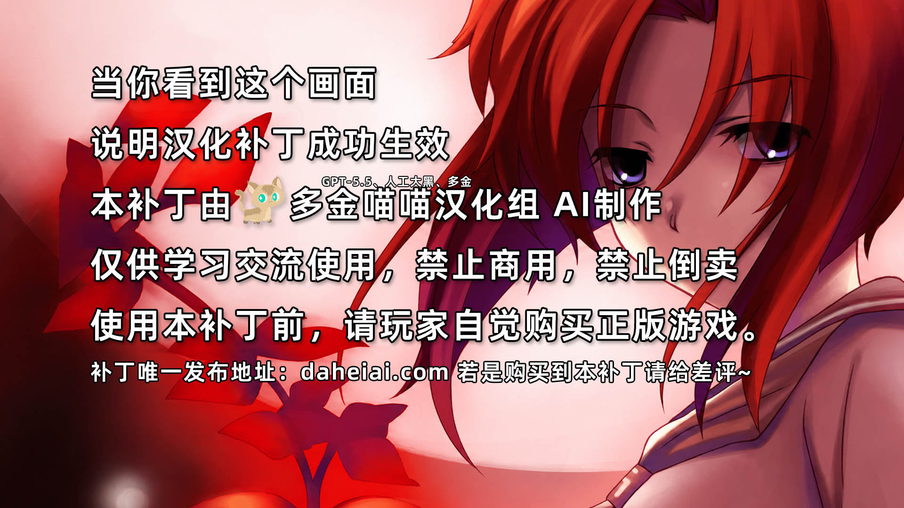
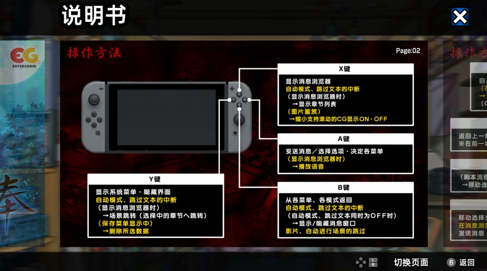
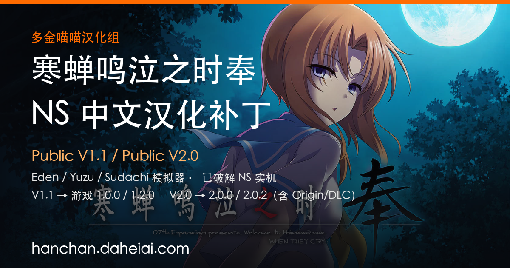

# 寒蝉鸣泣之时奉 · Switch 简体中文汉化补丁

**Higurashi no Naku Koro ni Hou — Nintendo Switch Simplified Chinese Patch**

## 这是什么

《寒蝉鸣泣之时奉》（Higurashi no Naku Koro ni Hou，Nintendo Switch）的**简体中文汉化补丁**，由**多金喵喵汉化组**制作。

补丁以 **LayeredFS / Mod** 形式加载，**不修改游戏本体**，**完全免费**。

- 游戏 Title ID：`0100F6A00A684000`
- 支持平台：被撅了的Switch一代机、各类NS模拟器
- 支持语言：简体中文（zh-CN）
- 官网与下载：[hanchan.daheiai.com/#downloads](https://hanchan.daheiai.com/#downloads)

## 版本对照

| 补丁版本 | 发布日期 | 适用游戏版本 | 说明 |
| --- | --- | --- | --- |
| **Public V2.2** | 2026-10-08 | 2.0.0 / 2.0.2 | 当前主推，含本体及 Origin / DLC 内容 |
| Public V1.1 | 2026-07-06 | 1.0.0 / 1.2.0 | V1 系列稳定版 |
| Public V2.0 | 2026-10-06 | 2.0.0 / 2.0.2 | V2 线上一版正式版 |
| 历史版本 V0.1 ~ V0.56 | 2026-06 | 1.0.0 / 1.2.0 | 见官网下载区 |

> 两条线**不能混用**。装错版本会出现缺字、乱码、界面不生效或闪退。

## 下载

### 👉 官方下载页：https://hanchan.daheiai.com/#downloads

提供**直链下载**、**百度网盘**、**夸克网盘**、**115 网盘**四种渠道，并附版本说明与更新记录。

## 安装

- [**Switch 实机（Atmosphère）安装指南**](docs/install-atmosphere.md)
- [**模拟器（Eden / Yuzu / Sudachi）安装指南**](docs/install-emulator.md)

## 汉化效果

 

 

## 常见问题

👉 [完整 FAQ（17 条）](docs/faq.md) · [版本历史](CHANGELOG.md) · [鸣谢](docs/credits.md)

## 姊妹项目

同一个汉化组还制作了 PSV 版补丁，与本案互不通用：

- **PSV《寒蝉鸣泣之时 粹》简体中文汉化补丁（测试版）** — https://github.com/daheiai/higurashi-sui-psv-cn

## 免责声明

本补丁仅供学习交流使用，**请购买正版游戏**。本项目与 07th Expansion、Entergram 无任何关联，不代表官方立场。

## 相关链接

- 官网：https://hanchan.daheiai.com/
- 《奉》攻略 Wiki：https://hanchan.daheiai.com/wiki/
- 《粹》攻略 Wiki：https://hanchan.daheiai.com/wiki-cui/
- 作者主页：https://daheiai.com/
